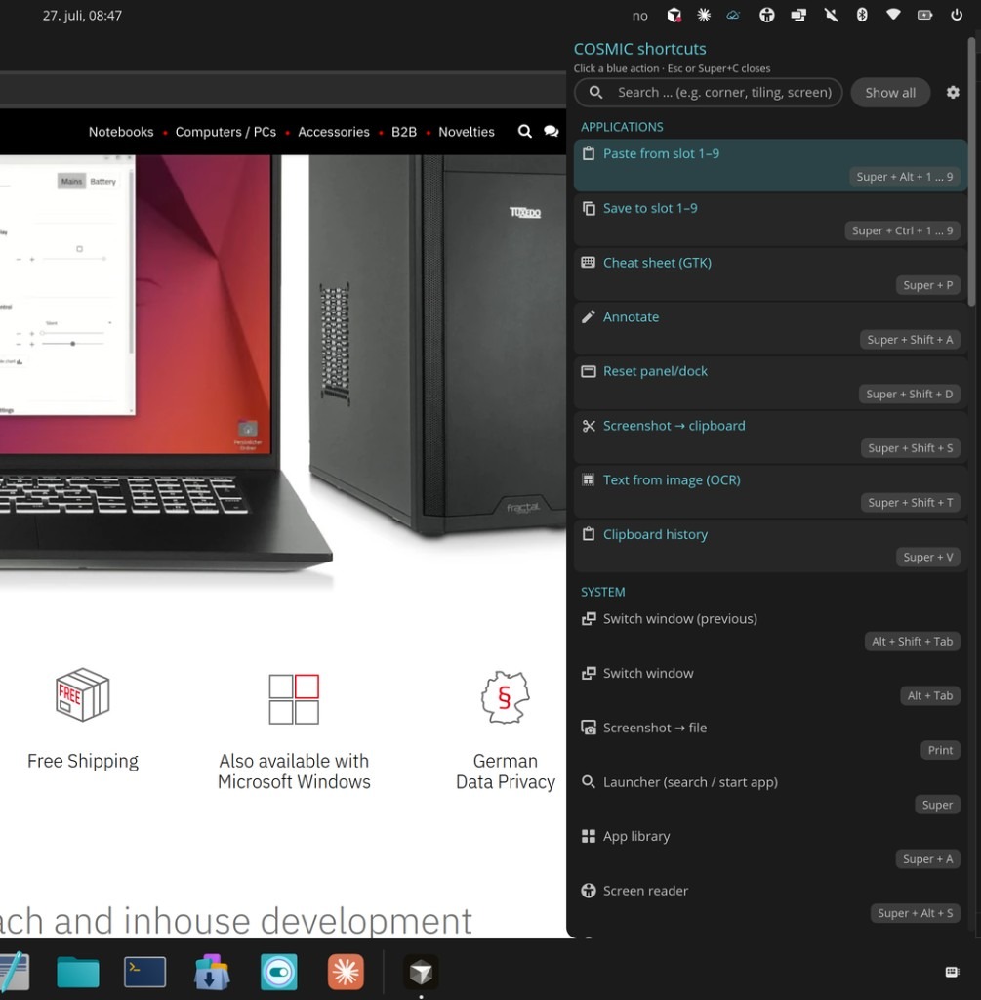

# cosmic-ext-applet-cheatsheet

A COSMIC **panel applet** + keybind overlay that shows your **actual keyboard
shortcuts** — read live from COSMIC Settings — as a searchable, learnable
cheat sheet.

Unlike a static list, it reads `com.system76.CosmicSettings.Shortcuts` (system
defaults + your custom bindings), so it always reflects *your* real keybindings
per machine. App-launch (`Spawn`) bindings stay clickable, and you can add your
own extra shortcuts and notes on top.

> Community extension (`cosmic-ext-*`). Works across COSMIC sessions (Pop!_OS /
> System76 and other COSMIC installs). Not a first-party `cosmic-applets` package.



## Features

- **Live COSMIC shortcuts** — defaults + custom, merged and grouped
- **Non-modal right-edge sheet** — desktop stays usable; Esc / Super+C / panel icon close
- **Multi-monitor** — opens on the output where the pointer is
- **Panel applet + keybind** — in-process open from the icon; `--window` toggles via IPC
- **Search**, arrow-key navigation, Enter to launch
- **Compact overview** (default) with **Show all** for the full dump
- **Symbolic icons**, **Fluent i18n** (9 languages), learning mode, custom notes

## Install from source

Requires Rust + a COSMIC session. [`just`](https://github.com/casey/just) optional.

```sh
git clone https://github.com/tomashaa/cosmic-ext-applet-cheatsheet.git
cd cosmic-ext-applet-cheatsheet
just install    # binary + .desktop + icon + metainfo → ~/.local
```

1. **Panel / Dock:** COSMIC Settings → add **Cheat Sheet**
2. **Keybind** (recommended Super+C) → Spawn:
   ```
   cosmic-ext-applet-cheatsheet --window
   ```

```sh
just build
just check
just uninstall
```

## Install with Flatpak (local)

Needs `flatpak`, `flatpak-builder`, Flathub SDK 25.08, and the COSMIC Flatpak
remote (`com.system76.Cosmic.BaseApp`).

```sh
just flatpak-install
```

Then add the applet in Settings. For Super+C use:

```
flatpak run io.github.tomashaa.CosmicExtCheatsheet --window
```

Uninstall:

```sh
just flatpak-uninstall
```

> Flathub does not take panel applets; the long-term store path is
> [`pop-os/cosmic-flatpak`](https://github.com/pop-os/cosmic-flatpak). This repo’s
> manifest is for local install / that submission later.

## Config

| Path | Purpose |
|------|---------|
| `~/.config/cosmic-ext-cheatsheet/custom.toml` | Extra shortcuts / notes (see `custom.toml.example`) |
| `~/.config/cosmic-ext-cheatsheet/settings.toml` | remember / learning / compact / **lang** |
| `~/.config/cosmic-ext-cheatsheet/learned.toml` | Shortcuts marked as learned |

## Status

**v0.1.0** — ready to try and share as a community applet.

- Shortcut config live-reloads via `cosmic-config`
- Corner-radius protocol disabled; rounding is drawn in-app
- CI on GitHub Actions; `just vendor` for offline builds
- Local Flatpak recipe included; COSMIC Store packaging still upcoming

Feedback and issues: <https://github.com/tomashaa/cosmic-ext-applet-cheatsheet/issues>

## License

GPL-3.0-only — see [`LICENSE`](LICENSE). Links COSMIC crates that are
GPL-3.0-only, so the whole work is distributed under the GPL.
